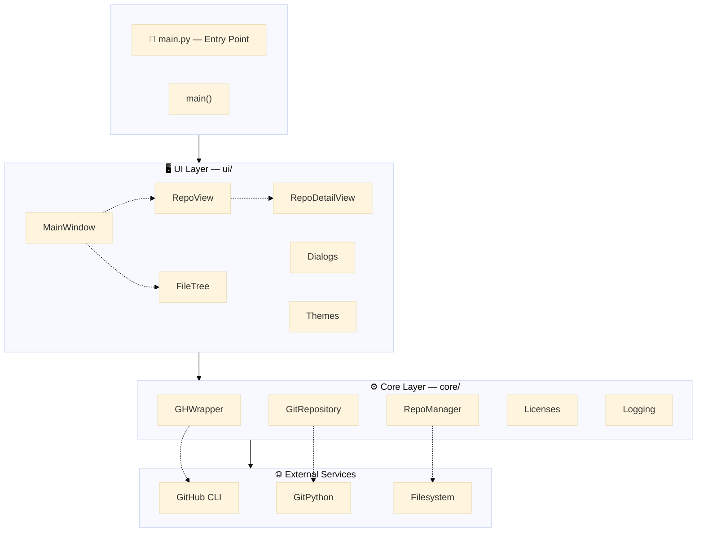
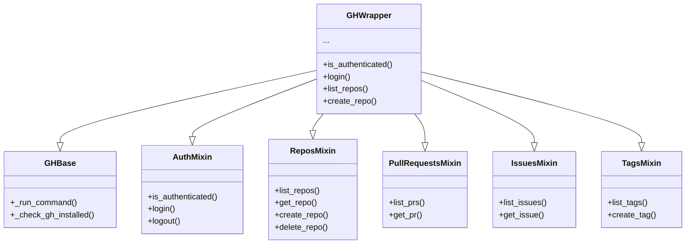
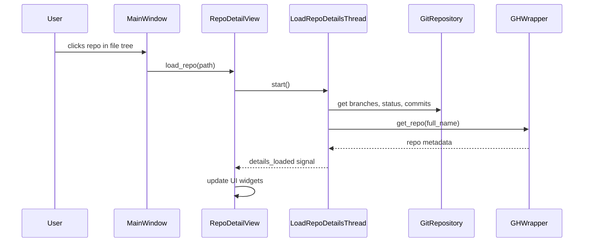

# Architecture

This document describes the software architecture of ghdesk, including design decisions, layer separation, and component responsibilities.

---

## Design Philosophy

ghdesk follows these core principles:

1. **Layered Separation** — Clear boundaries between UI, business logic, and external services
2. **Dependency Direction** — Outer layers depend on inner layers, never the reverse
3. **Single Responsibility** — Each module has one clear purpose
4. **Fail Fast** — Validate inputs early, fail with clear errors

---

## System Overview



---

## Layer Descriptions

### Entry Point (`main.py`)

The single entry point for the application. Responsibilities:

- Initialize logging
- Create `QApplication` instance
- Configure High DPI scaling
- Apply default theme
- Create and show `MainWindow`
- Start the event loop

```python
def main():
    setup_logging()
    app = QApplication(sys.argv)
    app.setStyleSheet(get_theme("dark"))
    window = MainWindow()
    window.show()
    sys.exit(app.exec())
```

**Rule**: All initialization happens here. No module should initialize global state at import time.

---

### UI Layer (`ui/`)

The interface layer. Contains all PyQt6 widgets, dialogs, and visual components.

**Responsibilities:**

- User interaction handling
- Display data from core layer
- Emit signals for user actions
- Apply themes and styling

**Key Components:**

| Module | Purpose |
|--------|---------|
| `main_window.py` | Main application window, toolbar, layout |
| `repo_view.py` | GitHub repository list with tabs |
| `repo_detail_view.py` | Repository details panel |
| `file_tree.py` | Filesystem navigation widget |
| `create_dialog.py` | Repository creation dialog |
| `commit_push_dialog.py` | Commit and push dialog |
| `pr_create_dialog.py` | Pull request creation dialog |
| `tag_dialog.py` | Tag/release creation dialog |
| `diff_viewer.py` | Syntax highlighter for git diffs |
| `themes/` | Theme stylesheets |

**Constraints:**

- UI components must NOT contain business logic
- UI must NOT directly execute shell commands
- UI must NOT directly access git libraries
- All data operations go through core layer

---

### Core Layer (`core/`)

The business logic layer. Contains all domain logic independent of how it's accessed.

**Responsibilities:**

- GitHub CLI interactions (via wrapper)
- Local git operations
- Repository discovery
- Data validation

**Key Components:**

| Module | Purpose |
|--------|---------|
| `github/` | GitHub CLI wrapper (modular design) |
| `git_operations.py` | Local git repository operations |
| `repo_manager.py` | Local repository discovery |
| `licenses.py` | License templates for repo creation |
| `logging_config.py` | Centralized logging configuration |

**Constraints:**

- Core must NOT import from `ui/`
- Core must NOT use PyQt6 or any UI framework
- Core must provide clean interfaces for UI consumption

---

### GitHub Module (`core/github/`)

The GitHub CLI wrapper is decomposed into focused mixins:



**Command Execution Pattern:**

```python
def _run_command(self, args: List[str], capture_json: bool = False) -> Dict:
    """
    All gh CLI calls go through this method.
    
    Returns:
        {"success": bool, "output": str|dict, "error": str}
    """
    cmd = ["gh"] + args
    result = subprocess.run(cmd, capture_output=True, text=True)
    # ... process result
```

**Why this design:**

- Single point for subprocess execution (easier to mock in tests)
- Consistent error handling
- Optional JSON parsing
- Centralized logging

---

### GitRepository Class (`core/git_operations.py`)

Wraps GitPython library to provide a clean interface:

```python
class GitRepository:
    """Isolates git library from UI components."""
    
    @property
    def current_branch(self) -> str: ...
    @property
    def is_dirty(self) -> bool: ...
    @property
    def branches(self) -> List[str]: ...
    
    def get_modified_files(self) -> List[str]: ...
    def get_staged_files(self) -> List[str]: ...
    def commit(self, message: str) -> bool: ...
    def push(self) -> Dict[str, Any]: ...
```

**Why wrap GitPython:**

- UI should not know about git library internals
- Easier to change git library in the future
- Can mock for UI tests without git dependency

---

## Dependency Rules

### What CAN Depend on What

```
✓ ui/ → core/                  (UI uses business logic)
✓ core/github/ → core/logging  (Internal core dependency)
✓ main.py → ui/, core/         (Entry point wires everything)
```

### What CANNOT Depend on What

```
✗ core/ → ui/                  (Core must not know about UI)
✗ ui/ → subprocess directly    (Must go through core)
✗ ui/ → git library directly   (Must go through GitRepository)
```

### Verification

The architecture is verified by checking imports:

```bash
# This should return NO results (core importing ui)
grep -r "from ui\|import ui" core/
```

---

## Data Flow

### Repository Loading Flow



### Background Threading Pattern

ghdesk uses Qt threads for operations that may block:

```python
class LoadRepoDetailsThread(QThread):
    """Background thread to load repository details"""
    details_loaded = pyqtSignal(dict)

    def run(self):
        details = load_repo_details(self.repo_path, self.gh)
        self.details_loaded.emit(details)
```

**UI stays responsive** — Long-running operations (git commands, network calls) happen in background threads. Results are emitted via signals to update the UI on the main thread.

---

## Error Handling Strategy

### Core Layer

- Raise exceptions for programmer errors
- Return result dicts for operational errors
- Log all errors with context

```python
def _run_command(self, args) -> Dict:
    try:
        result = subprocess.run(...)
        return {"success": result.returncode == 0, ...}
    except Exception as e:
        logger.exception("Command failed")
        return {"success": False, "error": str(e)}
```

### UI Layer

- Catch exceptions from core layer
- Display user-friendly error messages
- Never crash on user actions

```python
try:
    result = self.gh.create_repo(name, ...)
    if result["success"]:
        show_message_dialog(self, "Success", "Repository created")
    else:
        show_message_dialog(self, "Error", result["error"])
except Exception as e:
    show_message_dialog(self, "Error", f"Unexpected error: {e}")
```

---

## Configuration

### No Hardcoded Values

Configuration is centralized:

| File | Purpose |
|------|---------|
| `ui/constants.py` | UI dimensions, sizes, limits |
| `ui/styles.py` | Component style strings |
| `ui/themes/` | Complete theme stylesheets |

### Constants Example

```python
# ui/constants.py
APP_NAME = "ghdesk"
WINDOW_WIDTH = 1200
WINDOW_HEIGHT = 800
MARGIN_NONE = 0
MARGIN_MEDIUM = 10
```

---

## Extensibility Points

### Adding a New GitHub Operation

1. Create mixin in `core/github/`:
   ```python
   class MyOperationMixin:
       def my_operation(self, ...): ...
   ```

2. Add to `GHWrapper` inheritance chain:
   ```python
   class GHWrapper(GHBase, AuthMixin, ..., MyOperationMixin):
       pass
   ```

### Adding a New Dialog

1. Create dialog class in `ui/`:
   ```python
   class MyDialog(QDialog):
       def __init__(self, gh: GHWrapper): ...
   ```

2. Wire up from `MainWindow`:
   ```python
   def show_my_dialog(self):
       dialog = MyDialog(self.gh)
       dialog.exec()
   ```

### Adding a New Theme

1. Create theme in `ui/themes/my_theme.py`
2. Register in `ui/themes/__init__.py`

See [Themes and Customization](../user-guide/themes.md).

---

## Testing Strategy

### Unit Tests (`tests/`)

- Test core layer in isolation
- Mock external services (subprocess, git)
- Focus on business logic correctness

### Integration Tests

- Test UI components with mocked core
- Verify signal/slot connections

### Manual Testing

- Full application flow
- Theme rendering
- Cross-platform compatibility

See [Testing](testing.md) for details.
